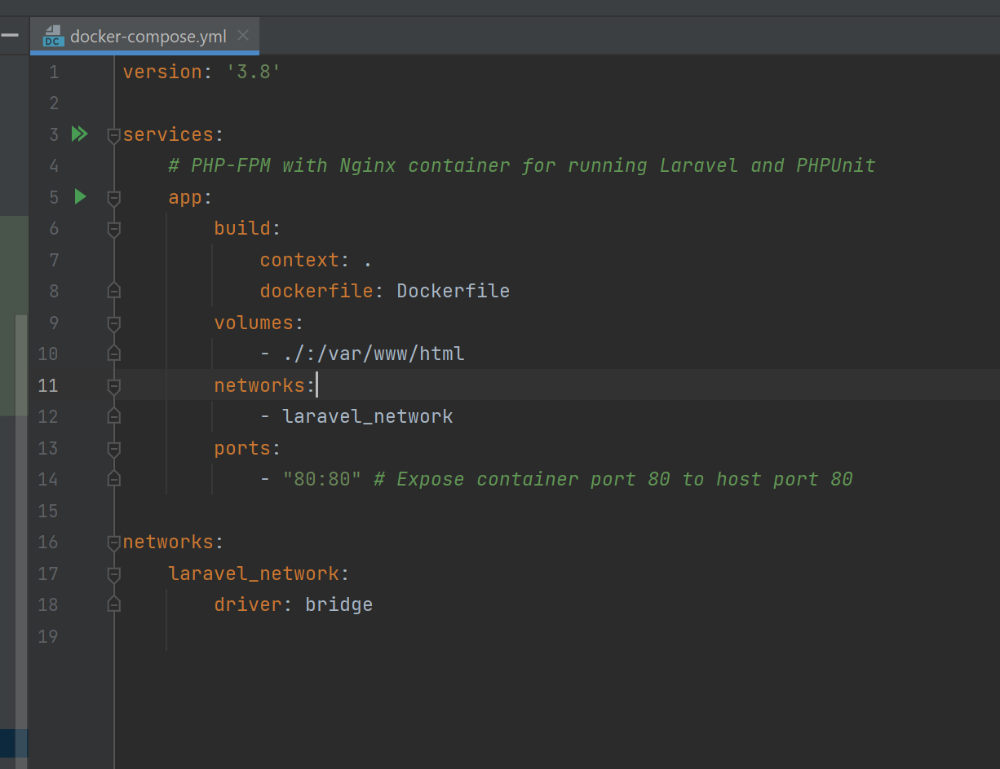
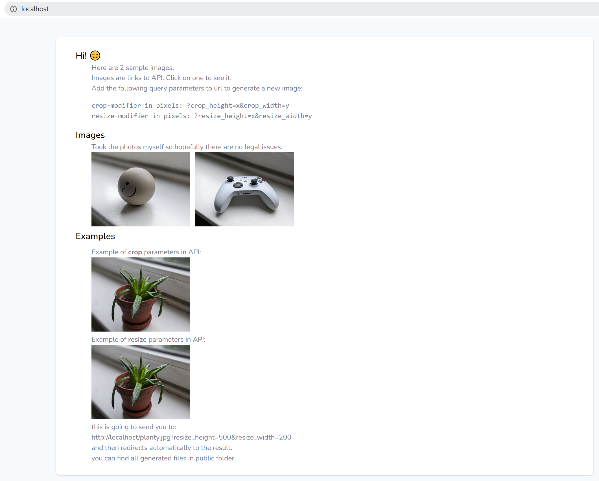
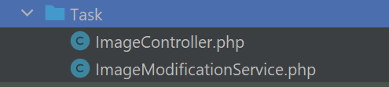
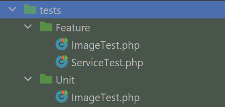
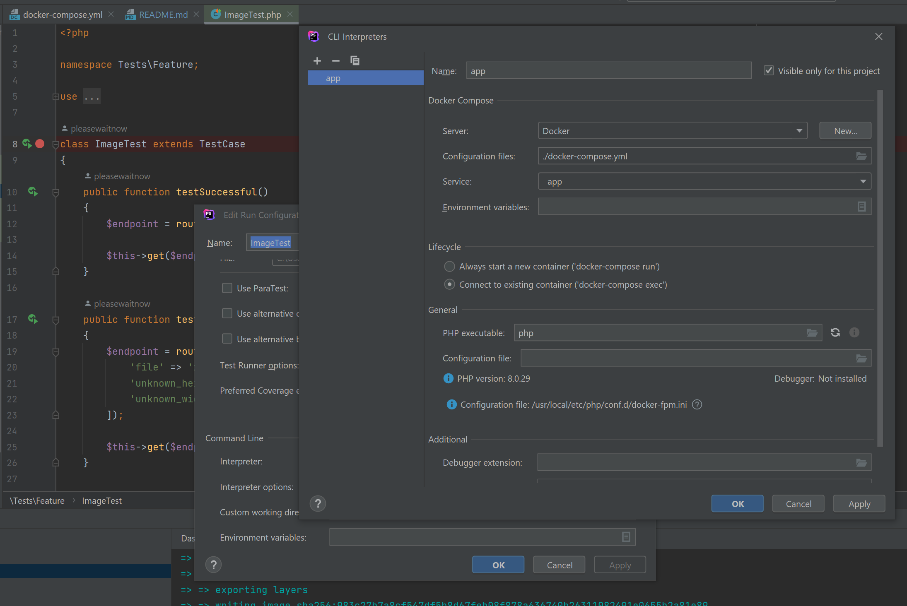

## Hi!

This is a sample project for modifying images.

Please, clone the project and open it. Next, you need to run docker.

Either run it in IDE:



or run:

```
docker-compose up -d
```

and then composer installation:

```
composer install
```

then open http://localhost

you get the visual explanation on how to use the API:



- There are 3 images provided to the API in the /public folder:

```
happy.jpg
xbox.png
planty.jpg
```

- There are 2 sets of modifiers supported:

```
?resize_height=X&resize_width=X
OR
?crop_height=X&crop_width=X
```

So it would look like this:

```
http://localhost/xbox.png?crop_height=300&crop_width=500
or
http://localhost/planty.jpg?resize_height=300&resize_width=500
```

It automatically makes the file and redirects.


## Where is the code?

the code is in the /Task folder.




## Where are the tests?

the tests are in the /tests folder.




You can run the tests using the unit test already included in the container.
Just need to connect your IDE to the current interpreter:



And connect the vendor autoloder in IDE settings to unit test in settings > framework testing

That is all. Bye.

## License

The Laravel framework is open-sourced software licensed under the [MIT license](https://opensource.org/licenses/MIT).
